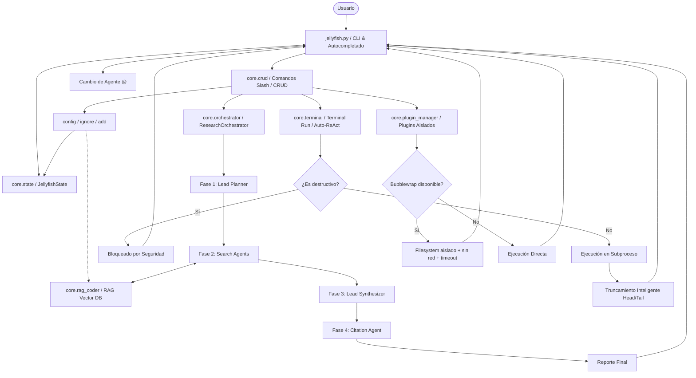

# 🪼 Jellyfish OS v5.1 — Manual Completo del Usuario y Desarrollador

Bienvenido a la documentación oficial de **Jellyfish OS**, un framework de agentes técnicos autónomos diseñado para ejecutarse localmente o en la nube. Jellyfish combina la potencia de modelos de lenguaje (a través de Ollama, OpenAI, DeepSeek y OpenRouter) con herramientas de ejecución del sistema, recuperación de información por vectores (RAG) y un orquestador multi-agente para la resolución de tareas complejas sobre bases de código.

---

## 🗺️ 1. Arquitectura y Flujo del Sistema

Jellyfish está diseñado de forma modular. Toda la interfaz gráfica transitoria y de interacción por consola reside en `jellyfish.py`, mientras que la lógica operativa y de control se encuentra centralizada en el directorio `core/`.

A continuación se muestra el diagrama de arquitectura y flujo de ejecución del sistema:



### Componentes Clave:
*   **`core/state.py`**: El cerebro de configuración del framework. Controla las variables de entorno, la persistencia en caliente de `.env`, el cálculo dinámico del presupuesto de tokens (Token Budget) y la carga/descarga de contextos.
*   **`core/crud.py`**: Controla el ciclo de vida de los comandos slash y la creación interactiva (CRUD) de nuevos agentes y habilidades.
*   **`core/rag_coder.py`**: Administra ChromaDB y el cálculo de embeddings para indexar y consultar código de forma inteligente y segura.
*   **`core/terminal.py`**: Interfaz con el sistema operativo que implementa protecciones de seguridad críticas.
*   **`core/plugin_manager.py`**: Mecanismo de extensión modular con aislamiento por Bubblewrap cuando está disponible y fallback seguro con timeout.
*   **`core/orchestrator.py`**: Implementación del flujo de investigación autónoma multi-agente.

---

## 🚀 2. Instalación y Configuración Inicial

### Requisitos Previos
1.  **Python 3.10 o superior**
2.  **Ollama** instalado y ejecutándose localmente (opcional si usas exclusivamente proveedores cloud).
    *   *Recomendado:* Modelo embeddings `nomic-embed-text` (`ollama pull nomic-embed-text`).
    *   *Recomendado:* Puedes configurar el modelo principal que prefieras según tu hardware y proveedor (ej. `llama3`, `mistral`, `claude`, etc.).
3.  **Dependencias del sistema:**
    *   `pip install -r requirements.txt`
    *   Para una instalación reproducible de CI o producción: `pip install -r requirements.lock`

### Variables de Entorno (`.env`)
Jellyfish almacena su configuración en un archivo `.env` en la raíz del proyecto. Tras escribir las API keys, el sistema bloquea automáticamente este archivo mediante permisos `chmod 600` para garantizar que otros usuarios locales no tengan acceso a tus credenciales.

El archivo `.env` no debe versionarse. Usa `.env.example` como plantilla pública y guarda tus claves reales únicamente en `.env`.

A continuación se detallan las variables soportadas:

| Variable | Valor por Defecto | Descripción |
| :--- | :--- | :--- |
| `JELLYFISH_PROVIDER` | `ollama` | Proveedor principal de LLM (`ollama`, `openai`, `deepseek`, `openrouter`, `gemini`, `qwen`, `kimi`, `zhipu`, `custom`). |
| `JELLYFISH_MODEL` | `(Depende del usuario)` | Modelo de lenguaje del agente principal (Lead Agent). Admite cualquier modelo compatible. |
| `JELLYFISH_SUBAGENT_PROVIDER` | *(Hereda de Provider)* | Proveedor alternativo para subagentes internos de búsqueda. |
| `JELLYFISH_SUBAGENT_MODEL` | *(Hereda de Model)* | Modelo alternativo para subagentes (útil para optimizar costes/velocidad). |
| `JELLYFISH_CONTEXT_LIMIT` | `8192` | Ventana máxima de tokens configurada en el LLM. |
| `JELLYFISH_RAG_THRESHOLD` | `1.2` | Umbral de similitud geométrica (distancia L2) para ChromaDB. |
| `JELLYFISH_EMBED_MODEL` | `nomic-embed-text` | Modelo de embeddings locales a utilizar en Ollama. |
| `JELLYFISH_PLUGIN_UNSAFE` | `0` | Si es `1`, se desactiva el aislamiento y los plugins se importan directamente. |
| `OPENAI_API_KEY` | *(Vacío)* | API Key para OpenAI. |
| `DEEPSEEK_API_KEY` | *(Vacío)* | API Key para DeepSeek. |
| `OPENROUTER_API_KEY` | *(Vacío)* | API Key para OpenRouter. |
| `GEMINI_API_KEY` | *(Vacío)* | API Key para Google Gemini usando el endpoint compatible con OpenAI. |
| `DASHSCOPE_API_KEY` | *(Vacío)* | API Key para Qwen / Alibaba DashScope. |
| `KIMI_API_KEY` | *(Vacío)* | API Key para Kimi / Moonshot AI. |
| `ZHIPU_API_KEY` | *(Vacío)* | API Key para Zhipu / GLM. |
| `CUSTOM_API_KEY` | *(Vacío)* | API Key para cualquier proveedor compatible con OpenAI Chat Completions. |

---

## 💡 3. Conceptos Fundamentales

### A. Contexto Activo vs. Contexto RAG
*   **Contexto Activo:** Son archivos vinculados de manera explícita por el usuario. Cuando añades un archivo individual al contexto, su contenido se lee y se inyecta **completo** directamente en el system prompt del modelo. Esto garantiza una precisión del 100%, pero consume gran cantidad de tokens.
*   **Contexto RAG:** Cuando vinculas una **carpeta** completa, Jellyfish no inyecta los archivos directamente. En su lugar, analiza la carpeta, segmenta el código fuente y genera representaciones vectoriales en ChromaDB. Al hacer preguntas, Jellyfish realiza búsquedas vectoriales y recupera únicamente los fragmentos más relevantes para tu consulta.

### B. Segmentación Inteligente de Código (AST-aware)
Para maximizar la relevancia del RAG, Jellyfish utiliza segmentación adaptativa por lenguaje (usando `langchain_text_splitters`).
*   Para archivos Python (`.py`), Jellyfish utiliza un parseador de **Árbol de Sintaxis Abstracta (AST)**. Esto asegura que clases y funciones se mantengan íntegras en un solo fragmento o chunk, evitando romper lógica semántica a la mitad de una función.
*   Para otros lenguajes de programación (`.js`, `.go`, `.rs`, `.html`, etc.), se utiliza un algoritmo semántico adaptado a la sintaxis del lenguaje.

### C. Aislamiento RAG por Proyecto
El RAG de Jellyfish previene la mezcla de código entre distintos proyectos. Cuando se indexa un directorio, Jellyfish genera un hash SHA1 único de la ruta absoluta del directorio y crea una subcarpeta ChromaDB dedicada (ej. `code_vector_db_4a5c6d7e`). Cada proyecto tiene una base vectorial aislada e independiente.

### D. Seguridad RAG contra Prompt Injections
Para evitar que un atacante inyecte instrucciones maliciosas en el código de tu repositorio y manipule las directrices del modelo, Jellyfish implementa delimitadores RAG blindados. En cada sesión, se genera un identificador UUID aleatorio que delimita los fragmentos de código del RAG:
```xml
<RAG_CTX_3C5B17B9>
  <FRAG_3C5B17B9 source="core/state.py" relevance="0.840">
    # Código del archivo...
  </FRAG_3C5B17B9>
</RAG_CTX_3C5B17B9>
```
El modelo está entrenado para reconocer estos delimitadores dinámicos y tratar su contenido estrictamente como datos de lectura.

### E. Presupuesto Dinámico de Tokens (Token Budget)
Para evitar errores de desbordamiento de contexto (`context window exceeded`), Jellyfish implementa una ventana deslizante de tokens inteligente. El sistema reserva el 20% del contexto para el prompt del sistema y la respuesta del modelo, y asigna el 80% restante para el historial de chat y archivos vinculados. Los mensajes más antiguos se descartan automáticamente cuando el límite del presupuesto se ve superado.

---

## 🛠️ 4. Guía Completa de Comandos

La interfaz interactiva de Jellyfish cuenta con autocompletado inteligente (usando la tecla `Tab`) para comandos slash, subcomandos e incluso nombres de agentes (`@`).

### Tabla de Referencia Rápida

| Comando | Alias | Subcomandos / Argumentos | Descripción |
| :--- | :--- | :--- | :--- |
| `/help` | `/h` | — | Muestra el manual de ayuda interactivo. |
| `/add` | — | `[ruta]` | Vincula un archivo al contexto activo o indexa una carpeta en el RAG. |
| `/context` | `/c` | — | Abre el administrador visual de archivos en el Contexto Activo. |
| `/purge` | — | — | Elimina completamente el Contexto Activo y la base de datos RAG. |
| `/rag` | — | `status`, `reindex [ruta]`, `remove [ruta]`, `clear` | Panel de control y mantenimiento de la base vectorial RAG. |
| `/agent` | `/a` | — | Abre el gestor CRUD de Agentes (Personalidades). |
| `/skill` | `/s` | — | Abre el gestor CRUD de Habilidades (Macros de consola). |
| `/run` | `/r` | `[comando]` | Ejecuta un comando en la shell del sistema y captura su salida. |
| `/plugin` | — | `[nombre] [args]` | Ejecuta un plugin registrado en el directorio `plugins/`. |
| `/provider` | — | — | Informa acerca del proveedor de IA y modelo activos. |
| `/config` | — | `show`, `provider [p]`, `model [m]`, `key [p] [k]`, `menu` | Permite la configuración dinámica del sistema en caliente. |
| `/ignore` | — | `show`, `init`, `add [patrón]`, `remove [patrón]`, `menu` | Administra exclusiones RAG en el archivo `.jellyfishignore`. |
| `/clear` | — | — | Limpia el historial de chat en pantalla sin alterar RAG ni contexto. |
| `/research` | — | `<consulta_compleja>` | Invoca al Orquestador Multi-Agente de Investigación. |
| `/exit` | — | — | Cierra de manera limpia Jellyfish OS. |

---

## 🔎 5. Explicación Detallada de Características Avanzadas

### 🗺️ A. Orquestador de Investigación (`/research`)
El comando `/research` ejecuta un flujo especializado de 4 agentes para resolver consultas de código de alta complejidad que requieren investigación profunda en todo el repositorio:

1.  **Lead Planner (Agente de Planificación):** Descompone la consulta del usuario en 1-3 preguntas secuenciales de investigación y genera un plan estructurado en JSON.
2.  **Search Agents (Agentes de Búsqueda):** Consultan silenciosamente el RAG para responder a cada uno de los sub-pasos del plan. Redactan resúmenes técnicos condensados sin saturar la terminal.
3.  **Lead Synthesizer (Agente de Síntesis):** Consolida la información recolectada por los agentes de búsqueda y redacta la respuesta final en modo streaming visible.
4.  **Citation Agent (Agente de Citación):** Analiza el reporte, valida que los archivos referenciados existan en el sistema y adjunta una tabla de enlaces en formato de URI de archivo (`file:///...`) al final del reporte.

Al finalizar, se despliega en consola una tabla rich con la duración de cada fase, el resumen de tokens estimados y el tiempo de respuesta total:

```
📊 Resumen del Pipeline de Investigación
┌───────────────────────┬──────────────────────────────┬──────────┐
│ Agente / Fase         │ Detalle                      │ Duración │
├───────────────────────┼──────────────────────────────┼──────────┤
│ 🗺  Lead Planner      │ 3 paso(s) planificados       │     1.4s │
│ 🔍 Search Agent 1     │ ~140 tokens · 2 fuentes      │     2.1s │
│ 🔍 Search Agent 2     │ ~180 tokens · 1 fuentes      │     1.8s │
│ 🔍 Search Agent 3     │ ~95 tokens · 0 fuentes       │     1.2s │
│ ✍  Lead Synthesizer   │ ~600 tokens generados        │     8.4s │
│ 📚 Citation Agent     │ 3 fuentes analizadas         │     0.5s │
└───────────────────────┴──────────────────────────────┴──────────┘
                                                 15.4s total
```

---

### 🛡️ B. Bucle Auto-ReAct (Ejecución Autónoma de Terminal)
Cuando Jellyfish funciona en modo interactivo clásico, el modelo puede proponer resolver una tarea ejecutando comandos en la terminal. Jellyfish intercepta estas intenciones y ejecuta el bucle de autonomía seguro:

1.  **Confirmación de Usuario:** Muestra en pantalla el comando propuesto y solicita confirmación manual (`y/n`).
2.  **Timeout de Confirmación:** Si el usuario no responde en **60 segundos**, el comando se cancela automáticamente por inactividad.
3.  **Lista Negra de Seguridad:** Los comandos destructivos se bloquean de manera absoluta en el código antes de interactuar con el sistema operativo, independientemente de si el usuario intenta forzar su ejecución. Los patrones bloqueados son:
    *   Comandos `rm` que contengan modificadores recursivos y de fuerza en cualquier posición (ej: `rm -rf`, `rm -r -f`, `rm -fr`).
    *   Uso de `mkfs` (formateo de particiones).
    *   Comandos `dd` con salida dirigida a dispositivos de bloque (ej: `dd of=/dev/sda`).
    *   Intentos de sobrescribir archivos del sistema de bloques (ej: `> /dev/sda`).
    *   Intentos de modificar permisos recursivamente sobre la raíz (ej: `chmod -R 777 /`).
    *   *Fork bombs* (`:(){ :|:& };:`).
4.  **Truncamiento Inteligente de Salidas:** Si un comando exitoso produce miles de líneas de salida (ej: compilaciones o ejecuciones de test), Jellyfish trunca el resultado preservando los primeros 2500 caracteres y los últimos 2500 caracteres, ya que es al final del flujo donde se concentran los códigos de error o trazas de excepción.

---

### 🎭 C. Agentes Personalizados (Taller de Personalidades)
Jellyfish te permite cargar "personalidades" de IA guardadas como plantillas Markdown en la carpeta `agents/`.
*   Para crear o editar un agente, usa `/agent`. El sistema abrirá un formulario guiado para detallar el alias del agente, rol, contexto de operación, tono, especialidades y reglas inquebrantables.
*   **Herencia de Directrices:** Los agentes heredan automáticamente las directivas del archivo `agents/template.md` (Protocolo Maestro), y a continuación agregan sus directivas específicas.
*   **Cambio Rápido:** Puedes cambiar de agente escribiendo `@nombre_agente` (ej. `@arquitecto_software`) en el chat.
*   **Autocompletado:** Al presionar `@` y presionar `Tab`, se listarán los agentes con una vista previa de su propósito.
*   **Restauración:** Usa `@exit` para volver al agente general por defecto.

---

### 🛠️ D. Habilidades (Skills)
Las habilidades son "recetas" de comandos que enseñan a la IA a ejecutar secuencias de terminal complejas con su debido manejo de errores. Se almacenan en el directorio `skills/`.
*   Para crear una habilidad, usa `/skill`. Al igual que con los agentes, se abrirá un asistente interactivo.
*   Una habilidad describe dependencias a instalar, comandos exactos de terminal a ejecutar, y el flujo de resolución de problemas si algo sale mal.
*   Cuando habilitas una Skill, su archivo Markdown se añade al contexto del modelo para que este comprenda cómo y cuándo debe invocar dicha secuencia de terminal.

---

### 📦 E. Plugins con Aislamiento en Sandbox
Los plugins permiten extender Jellyfish ejecutando scripts Python personalizados. Se guardan en la carpeta `plugins/` (deben implementar una función `execute(args: str) -> str`).

#### Ejecución en Sandbox
Por defecto, Jellyfish implementa un aislamiento robusto para plugins:
*   Si `bubblewrap` está disponible, cada plugin se ejecuta en un filesystem aislado, sin red y sin acceso al `.env`.
*   Si `bubblewrap` no está disponible, se usa un subproceso Python aislado (`-I`), entorno sin claves y límites de recursos.
*   **Timeout automático:** Si el plugin se congela o realiza un bucle infinito, el sistema lo finaliza automáticamente al alcanzar **30 segundos** de inactividad.
*   **Prevención de Excepciones:** Errores o caídas de memoria dentro de un plugin no afectan al proceso interactivo principal de Jellyfish.
*   **Override Unsafe:** Si deseas desactivar el sandbox (por ejemplo, para depurar dependencias o interactuar directamente con la memoria del proceso), puedes establecer en tu terminal la variable de entorno `export JELLYFISH_PLUGIN_UNSAFE=1` antes de lanzar la aplicación.

---

## 🛠️ 6. Solución de Problemas (Troubleshooting)

### A. ChromaDB corrupto tras un cierre repentino
Si la base de datos de vectores se corrompe (error de lectura de sqlite3 o ChromaDB), Jellyfish detectará el fallo en el inicio, eliminará de forma segura el directorio corrupto e informará al usuario en pantalla para que reindexe con `/add`.

### B. Timeout de comandos largos
Si ejecutas un comando mediante `/run` o a través del bucle ReAct que tarda demasiado tiempo (ej: descarga de contenedores docker pesados), puedes especificar un timeout personalizado agregando el flag `--timeout` al comando:
```bash
/run docker pull tensorflow/tensorflow:latest-gpu --timeout=600
```

### C. El RAG no recupera los archivos del proyecto
*   Verifica que no estén siendo excluidos por `.jellyfishignore`.
*   Verifica el umbral de similitud en tu `.env` (`JELLYFISH_RAG_THRESHOLD`). Si el valor es muy bajo (ej: `0.5`), ChromaDB descartará fragmentos ligeramente distantes. Puedes incrementarlo a `1.5` o `2.0` para una búsqueda más tolerante.
*   Asegúrate de haber instalado y descargado el modelo de embeddings en Ollama:
    ```bash
    ollama pull nomic-embed-text
    ```
