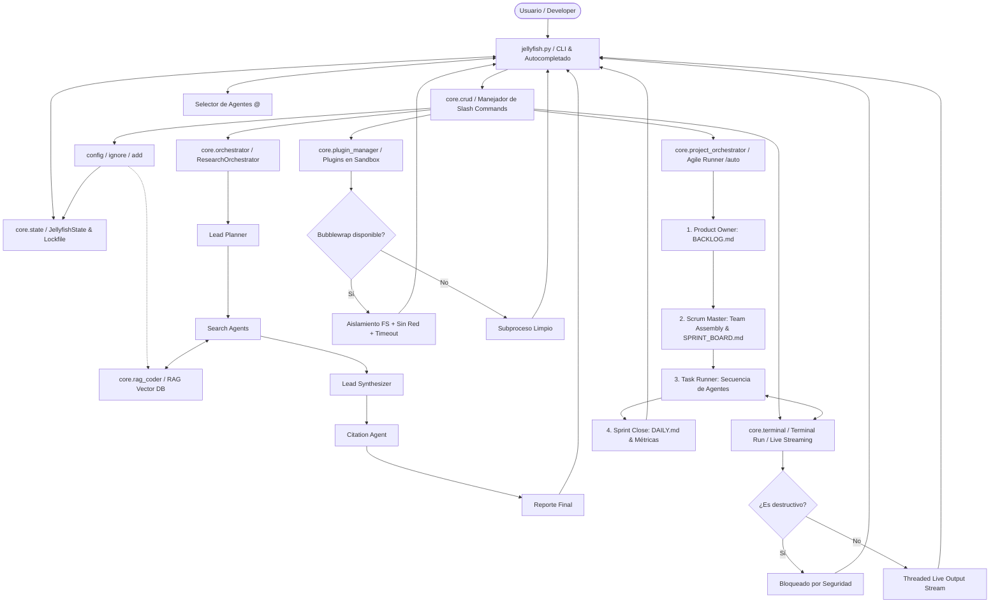

# 🪼 Jellyfish OS v5.2 — Manual Completo del Usuario y Desarrollador

Bienvenido a la documentación oficial de **Jellyfish OS v5.2**, un framework avanzado de agentes autónomos y orquestación ágil diseñado para ejecutarse de forma nativa en Linux con soporte para proveedores de IA locales y en la nube. 

Jellyfish combina la potencia de múltiples LLM (a través de Ollama, OpenAI, DeepSeek, Google Gemini y OpenRouter) con una suite de herramientas del sistema, persistencia vectorial para RAG (Retrieval-Augmented Generation) y un orquestador Scrum autónomo capaz de armar un equipo dinámico, planificar sprints y autoejecutar tareas de desarrollo.

---

## 🗺️ 1. Arquitectura y Estructura del Core

Jellyfish está diseñado con un desacoplamiento estricto entre la interfaz de usuario interactiva (`jellyfish.py`) y la lógica operativa del framework, la cual reside íntegramente en el directorio `core/`.

### Diagrama de Arquitectura y Flujo



### Componentes Clave (`core/`)

*   **`core/state.py`**: El núcleo de datos del sistema. Controla la persistencia en caliente de la configuración en el `.env`, la inicialización de variables globales, la adquisición exclusiva de locks sobre el proyecto activo, el cálculo de presupuestos de tokens, y expone la heurística avanzada `estimate_tokens(text)`.
*   **`core/crud.py`**: Administra la lógica detrás de cada comando `/` (slash command) y la interfaz interactiva para el alta, baja, modificación y consulta (CRUD) de agentes y habilidades. También implementa el selector de menús visuales.
*   **`core/rag_coder.py`**: Interfaz con ChromaDB. Implementa la segmentación inteligente de archivos de código utilizando parseadores AST (Abstract Syntax Trees) para Python y segmentación adaptativa para otros lenguajes de programación, indexando el código según la ruta del proyecto activo.
*   **`core/terminal.py`**: Ejecuta comandos en la terminal de Linux. Protege el sistema operativo mediante un motor de detección de comandos destructivos (lista negra de regex) y proporciona un flujo de salida en vivo (live streaming) para comandos de larga duración.
*   **`core/plugin_manager.py`**: Administra la extensión de funciones del framework mediante plugins de Python. Gestiona el aislamiento en sandbox a través de `bubblewrap` (restringiendo acceso al disco del sistema y cortando acceso a la red externa) o mediante aislamiento de entorno en subprocesos.
*   **`core/project_orchestrator.py`**: El orquestador autónomo de metodología Scrum. Escanea talentos locales, arma el equipo del Sprint, parsea el tablero Kanban y ejecuta de manera autónoma las tareas asignando el contexto al desarrollador correspondiente.
*   **`core/tui.py`**: El motor TUI (Text User Interface). Renderiza el header de estado interactivo del sistema y controla la impresión y animación de las barras de progreso parpadeantes en consola.
*   **`core/ui.py`**: Proporciona componentes visuales avanzados para la terminal, incluyendo visualizadores de bloques de código formateados y paneles decorativos utilizando la biblioteca Rich.

---

## 🚀 2. Instalación y Configuración Inicial

### Requisitos del Sistema
1.  **Python 3.10 o superior**
2.  **Bubblewrap** (opcional, recomendado para sandbox seguro de plugins):
    ```bash
    sudo apt install bubblewrap
    ```
3.  **Ollama** ejecutándose localmente (si se desea RAG local y modelos offline):
    *   Descargar e instalar desde [Ollama.com](https://ollama.com).
    *   Descargar el modelo de embeddings: `ollama pull nomic-embed-text`.
    *   Descargar un modelo de chat: `ollama pull llama3` o `ollama pull mistral`.

### Instalación de Dependencias
Instala los paquetes de Python utilizando el archivo de bloqueo para asegurar la compatibilidad exacta de las versiones:
```bash
pip install -r requirements.lock
```

### Configuración del Entorno (`.env`)
El framework almacena y recupera sus claves y configuraciones desde un archivo `.env` en la raíz del proyecto. Tras modificar la configuración o añadir API keys, **Jellyfish restringe de forma automática los permisos del archivo a `600` (`chmod 600`)** para asegurar que ningún otro usuario local de la máquina pueda leer tus claves.

Crea un archivo `.env` basado en el siguiente catálogo de opciones:

| Variable | Valor por Defecto | Descripción |
| :--- | :--- | :--- |
| `JELLYFISH_PROVIDER` | `ollama` | Proveedor de IA activo (`ollama`, `openai`, `deepseek`, `openrouter`, `gemini`, `custom`). |
| `JELLYFISH_MODEL` | `gemini-3.1-pro` | Modelo de lenguaje utilizado por el agente interactivo principal. |
| `JELLYFISH_SUBAGENT_PROVIDER`| *(Hereda de Provider)* | Proveedor de IA alternativo utilizado para subagentes del orquestador. |
| `JELLYFISH_SUBAGENT_MODEL`   | *(Hereda de Model)*    | Modelo alternativo de IA utilizado para subagentes del orquestador. |
| `JELLYFISH_CONTEXT_LIMIT`    | `8192` | Ventana máxima de tokens permitida para el contexto del LLM. |
| `JELLYFISH_RAG_THRESHOLD`    | `1.2` | Umbral de distancia geométrica (L2) para resultados ChromaDB. |
| `JELLYFISH_EMBED_MODEL`      | `nomic-embed-text` | Modelo de embeddings locales a invocar en Ollama. |
| `JELLYFISH_PLUGIN_UNSAFE`    | `0` | Si es `1`, se desactivará el sandbox y aislamiento de plugins. |
| `OPENAI_API_KEY`             | *(Vacío)* | API Key para OpenAI. |
| `DEEPSEEK_API_KEY`           | *(Vacío)* | API Key para DeepSeek. |
| `OPENROUTER_API_KEY`         | *(Vacío)* | API Key para OpenRouter. |
| `GEMINI_API_KEY`             | *(Vacío)* | API Key para Google Gemini (compatible con el formato de la API OpenAI). |
| `CUSTOM_API_KEY`             | *(Vacío)* | API Key para cualquier proveedor compatible con OpenAI Chat Completions. |

---

## 💡 3. Conceptos de Seguridad y Hardening en V5.2

Jellyfish OS v5.2 incorpora importantes medidas de robustez y seguridad para su uso en entornos profesionales de desarrollo de software:

### 🔒 A. Prevención de Concurrencia de Proyectos (`.jellyfish.lock`)
Para evitar fallos por condiciones de carrera o la corrupción de bases de datos compartidas (como la base de vectores ChromaDB o la caché de estado de SQLite), Jellyfish implementa un sistema de adquisición exclusiva por proyecto:
*   Al activar un proyecto con `/project`, se escribe un archivo oculto `.jellyfish.lock` en el directorio raíz del proyecto que registra el PID del proceso de Jellyfish activo.
*   Si abres otra instancia de Jellyfish en la misma carpeta del proyecto, el sistema comprobará si el PID almacenado sigue vivo (`os.kill(pid, 0)`). De ser así, abortará la vinculación y mostrará una advertencia para evitar la colisión.
*   Al salir de la aplicación de manera normal, un destructor programado mediante `atexit` se encarga de eliminar el lockfile de forma limpia.

### 📊 B. Estimador de Tokens de Alta Fidelidad (`estimate_tokens`)
Olvídate del cálculo impreciso basado en dividir caracteres entre 4 (`len // 4`). Jellyfish OS v5.2 cuenta con un estimador avanzado basado en expresiones regulares:
*   **Ponderación de Sintaxis:** Cada símbolo y operador especial común en la programación (`{ } [ ] ( ) : ; . , = + - * / < > ! & \|`) se pondera explícitamente con un factor de `0.75` tokens, ya que la codificación de tokens (como BPE) fragmenta significativamente los símbolos en el código.
*   **Ponderación del Lenguaje:** El texto plano se estima basándose en una proporción optimizada para texto en español y código de desarrollo.
*   **Ahorro de API:** Permite predecir de forma muy ajustada el tamaño real de los fragmentos antes de enviarlos a modelos comerciales, optimizando el uso de la ventana deslizante y previniendo los errores de tipo `Context Window Exceeded`.

### 📡 C. Transmisión en Tiempo Real (Live Output Streaming)
Los comandos interactivos de larga duración (como `npm install`, `npx create-react-app`, o descargas de paquetes grandes) solían hacer que la consola pareciera congelada debido al buffering en subprocessos.
*   Jellyfish OS v5.2 ejecuta los comandos de terminal utilizando tuberías no bloqueantes (`subprocess.PIPE` y `stderr=subprocess.STDOUT`).
*   Un hilo dedicado (`threading.Thread`) captura e imprime en la salida estándar de tu pantalla cada línea generada por el proceso de forma inmediata, permitiéndote ver instaladores y salidas detalladas en tiempo real.
*   Al finalizar, compila todo el flujo impreso en una sola respuesta histórica para inyectar al contexto del agente del LLM de forma limpia.

### 🛡️ D. Previsualización Clara de Comandos Sugeridos
Los comandos potencialmente peligrosos propuestos por los agentes ya no se truncan de forma confusa en una sola línea de texto plano de 200 caracteres.
*   Jellyfish genera un **Rich Panel** decorado de color amarillo que muestra el código Bash completo del comando sugerido con resaltado de sintaxis nativo (`Syntax` theme monokai).
*   **Sin Auto-Rechazo Apresurado:** Se ha eliminado la cuenta atrás de 60 segundos que rechazaba comandos automáticamente, dándole control absoluto al desarrollador para revisar, editar o aprobar la ejecución interactiva indefinidamente con un prompt seguro basado en `Confirm.ask`.

### 🎭 E. Modo de Product Owner Dinámico para el Agente `@default`
Para apegarse fielmente a las metodologías ágiles:
*   Si no hay ningún proyecto activo, el agente `@default` actúa como un asistente técnico general.
*   En el momento en que se activa un proyecto con `/project`, el sistema reconfigura en caliente el Prompt del Sistema del agente `@default` para actuar como el **Product Owner (PO)**.
*   Bajo este rol, el agente conversará contigo para estructurar tus ideas en el `BACKLOG.md` mediante historias de usuario y criterios de aceptación, y se rehusará a actuar como Scrum Master o programar tareas hasta que confirmes la aprobación del backlog del producto.

### ⚙️ F. Gestión Inteligente de Ollama y Tolerancia del RAG
Para asegurar la disponibilidad de la base vectorial local de embeddings:
*   Al iniciar Jellyfish OS, el sistema verifica de forma no bloqueante si el servicio de Ollama responde en la URL configurada.
*   Si el servicio no responde, intenta levantarlo automáticamente ejecutando `ollama serve` en segundo plano.
*   Si no está instalado o no se puede iniciar, muestra un Warning controlado en la terminal y pone el estado del RAG en `RAG[ERR]` de forma segura, previniendo que se intente inicializar incorrectamente o que se borre la base vectorial local ChromaDB existente.

---

## 📋 4. Orquestador de Metodología Scrum y Flujo Autónomo

Jellyfish OS implementa un orquestador ágil autónomo diseñado para gestionar y construir proyectos completos a través de la simulación síncrona de agentes.

### Los 4 Archivos de Seguimiento Scrum
Cuando ejecutas `/project` y creas un proyecto, se inician los siguientes archivos en la raíz del mismo:
1.  **`SCRUM_METHODOLOGY.md`**: Detalla el estándar ágil del proyecto, la definición de "Terminado" (Definition of Done) y las pautas operativas del equipo.
2.  **`BACKLOG.md`**: El backlog del producto organizado como una tabla Markdown de historias de usuario (`US-001`, `US-002`), sus estimaciones de tamaño de camiseta, y su prioridad.
3.  **`SPRINT_BOARD.md`**: El tablero Kanban interactivo del sprint activo. Organiza las tareas asignadas a agentes en tres columnas claras: `## 📋 POR HACER (TODO)`, `## ⏳ EN PROCESO (IN PROGRESS)` y `##  HECHO (DONE)`.
4.  **`DAILY.md`**: Registro histórico de actividades del Scrum. Cada vez que un agente completa una tarea, escribe su bitácora diaria indicando el avance, impedimentos y siguientes pasos.

### Ejecución de la Agencia Autónoma (`/auto` o `/build`)
Cuando el backlog del producto está listo y aprobado en tu proyecto activo, puedes arrancar la agencia autónoma ejecutando `/auto`. Esto inicia el pipeline ágil autogestionado:

```
[Usuario ejecuta /auto]
       │
       ▼
Fase 1: Product Owner (PO)
   - Analiza BACKLOG.md.
   - Valida si las historias tienen criterios de aceptación claros.
   - Checkpoint: Solicita confirmación al usuario para iniciar el Sprint.
       │
       ▼
Fase 2: Scrum Master (SM)
   - Escanea la carpeta `agents/*.md` para obtener los agentes de desarrollo disponibles.
   - Lee las historias del Backlog.
   - Diseña un plan de Sprint dinámico, asignando cada tarea al agente más capacitado para ella.
   - Escribe el archivo oculto `TEAM_PLAN.json` y actualiza el tablero `SPRINT_BOARD.md` (columna TODO).
       │
       ▼
Fase 3: Task Runner (Ejecución Autónoma)
   - Lee el plan de tareas asignadas del Sprint.
   - Para cada tarea de forma secuencial:
       1. Carga las directivas y contexto del agente asignado (ej. `@backend_dev`).
       2. Actualiza el tablero: Mueve la tarea a la columna IN PROGRESS.
       3. El agente genera y ejecuta comandos en la terminal (con streaming live en tu consola).
       4. El agente escribe los archivos de código correspondientes a la tarea.
          * El Task Runner implementa un parser que busca bloques de código reales dentro de la respuesta del agente.
          * Si el agente responde usando etiquetas XML (<write_file path="...">...</write_file>) o anotaciones Markdown ([WRITE_FILE: path] + code block), el sistema operativo crea automáticamente los directorios y archivos de código real.
       5. Al terminar, el sistema mueve la tarea a la columna DONE en el tablero.
       6. El agente registra su bitácora de actualización en `DAILY.md`.
       │
       ▼
Fase 4: Cierre del Sprint
   - El Scrum Master verifica que todas las tareas estén completadas.
   - Genera una tabla de métricas en consola con tiempos de ejecución, consumo de tokens y estado.
```

---

## 🛠️ 5. Guía Completa de Comandos

| Comando | Alias | Sintaxis | Descripción |
| :--- | :--- | :--- | :--- |
| `/help` | `/h` | `/help` | Muestra la guía interactiva y la lista completa de comandos slash. |
| `/add` | — | `/add <ruta>` | Añade un archivo al contexto activo. Si se le pasa un directorio, lo indexará en la base vectorial del RAG. |
| `/context` | `/c` | `/context` | Muestra el panel visual del contexto activo y permite ver qué archivos se están inyectando en el system prompt. |
| `/purge` | — | `/purge` | Vacía completamente la lista de archivos del contexto activo y elimina los índices vectoriales de ChromaDB del proyecto actual. |
| `/rag` | — | `/rag <status\|clear\|reindex>` | Comando de mantenimiento del RAG. Permite ver el estado de la base de vectores o forzar la reindexación de carpetas. |
| `/agent` | `/a` | `/agent` | Menú interactivo (CRUD) para crear, editar, listar o eliminar agentes personalizados. |
| `/skill` | `/s` | `/skill` | Menú interactivo (CRUD) para crear, editar, listar o eliminar habilidades técnicas. |
| `/run` | `/r` | `/run <comando>` | Ejecuta un comando en la consola del sistema operativo y lo añade al historial conversacional. |
| `/plugin` | — | `/plugin <nombre> [args]` | Lanza un script de extensión de Python en sandbox. |
| `/provider` | — | `/provider` | Informa sobre el proveedor LLM configurado actual y el modelo activo. |
| `/config` | — | `/config <show\|provider\|model\|key>` | Configura en caliente cualquier parámetro del `.env` sin tener que cerrar Jellyfish. |
| `/ignore` | — | `/ignore <show\|add\|remove>` | Administra las reglas de exclusión de indexado RAG dentro del archivo `.jellyfishignore`. |
| `/project` | `/p` | `/project` | Abre el administrador de proyectos Scrum. Permite inicializar la estructura Scrum en una carpeta, ver el estado actual del proyecto, desvincular o borrar el proyecto activo. |
| `/clear` | — | `/clear` | Limpia la pantalla del terminal de forma segura. |
| `/research` | — | `/research <consulta>` | Ejecuta la tubería de investigación profunda en 4 fases utilizando subagentes y citación de archivos. |
| `/auto` | `/build` | `/auto` | Lanza la orquestación y el desarrollo de software autónomo bajo Scrum. |
| `/exit` | — | `/exit` | Cierra la sesión activa de Jellyfish OS liberando los bloqueos del proyecto. |

---

## 📦 6. Desarrollo de Plugins y Sandbox de Aislamiento

Jellyfish OS permite ampliar su funcionalidad nativa escribiendo plugins en Python dentro de la carpeta `plugins/`.

### Requisitos de un Plugin
Para que un plugin sea válido, debe cumplir con la estructura mínima de archivo Python, exportando una función llamada `execute`:
```python
# plugins/calculadora_iva.py
import sys

def execute(args: str) -> str:
    """Calcula el IVA (16%) de un valor entregado en args.
    
    Jellyfish llama a esta función inyectando todo el texto que el usuario
    escribe después del comando /plugin calculadora_iva <args>
    """
    try:
        monto = float(args.strip())
        iva = monto * 0.16
        total = monto + iva
        return f"Monto: ${monto:.2f} | IVA: ${iva:.2f} | Total: ${total:.2f}"
    except ValueError:
        return "Error: Debes proporcionar un número válido como argumento."
```

### Funcionamiento del Sandbox con Bubblewrap
Cuando un agente o usuario invoca `/plugin calculadora_iva 100`, Jellyfish OS busca aislar la ejecución de la siguiente forma:
1.  **Detección de Bubblewrap:** Busca el ejecutable `bwrap` en el path del sistema.
2.  **Aislamiento de Filesystem:** Crea un espacio de nombres privado montando en modo de solo lectura `/usr`, `/lib`, `/bin` y directorios del sistema mínimos para que funcione Python.
3.  **Aislamiento de Red:** Ejecuta el subproceso utilizando el flag `--unshare-net` de bubblewrap. El plugin no podrá realizar llamadas HTTP, interactuar con APIs externas ni exfiltrar datos.
4.  **Aislamiento de Configuración:** No se montan las variables de entorno locales ni el archivo `.env`, protegiendo las API keys de accesos ilegítimos por parte de código de terceros.
5.  **Control de Recursos:** Si el plugin contiene bucles infinitos, se mata automáticamente al alcanzar el límite de tiempo de 30 segundos.

---

## 🛠️ 7. Solución de Problemas (Troubleshooting)

### A. Advertencia de Concurrencia de Proyecto ("Proyecto bloqueado")
*   **Síntoma:** Al abrir un proyecto, Jellyfish muestra una alerta en rojo indicando que hay una instancia activa y no te permite interactuar con él.
*   **Solución:** Si la instancia anterior se cerró de forma forzosa (por ejemplo, por un apagón de energía o un error del sistema que impidió la limpieza del lockfile), puedes eliminar el archivo de bloqueo de forma manual corriendo:
    ```bash
    rm /ruta/de/tu/proyecto/.jellyfish.lock
    ```

### B. Fallos en el RAG por conectividad con Ollama
*   **Síntoma:** Aparecen errores de tipo `Failed to connect to Ollama` o `Chroma.add_texts`.
*   **Solución:** Asegúrate de que Ollama está activo en el sistema. Puedes comprobar su estado o levantarlo de forma manual con:
    ```bash
    ollama serve
    ```
    Si usas modelos de chat basados en la nube (como Gemini o Claude) pero tienes el RAG en modo local, es obligatorio contar con el modelo de embeddings descargado localmente:
    ```bash
    ollama pull nomic-embed-text
    ```

### C. La terminal se congela al ejecutar comandos
*   **Síntoma:** Comandos interactivos de consola se quedan colgados esperando entrada del usuario sin mostrar nada.
*   **Solución:** Jellyfish OS v5.2 ya soluciona este comportamiento transmitiendo la salida en vivo. Si aún detectas que un comando espera una confirmación y no puedes escribir, cancela con `Ctrl+C` y asegúrate de agregar flags de no-interactividad al comando (ej. `npm install --yes` o `apt install -y`).

---

DOCUMENTACIÓN COMPLETA PARA JELLYFISH OS V5.2. MANTENIDO POR EL EQUIPO DE DESARROLLO.
