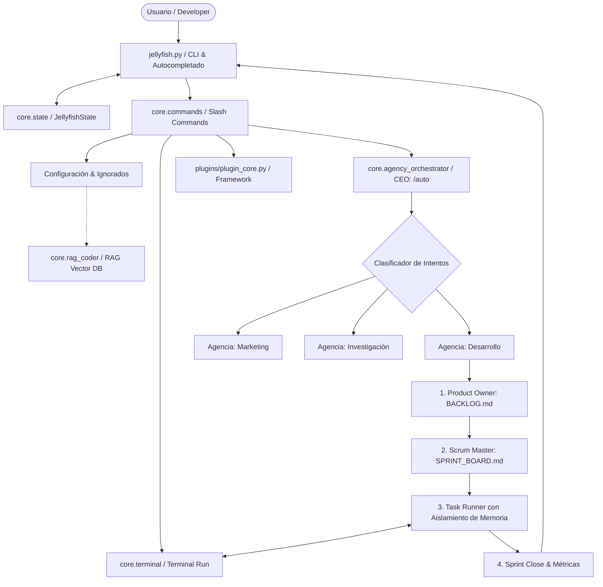

# 🪼 Jellyfish OS v6.9.3 — Manual Completo del Usuario y Desarrollador

Bienvenido a la documentación oficial de **Jellyfish OS v6.9.3**, un sistema operativo de agentes cognitivos corporativos, arquitectura multi-agencia y framework de orquestación ágil/secuencial diseñado para ejecutarse de forma nativa en sistemas Linux.

Jellyfish combina la potencia de múltiples modelos de lenguaje a gran escala (LLMs a través de Ollama, OpenAI, DeepSeek, Google Gemini y OpenRouter) con una robusta suite de herramientas del sistema, persistencia vectorial para RAG (Retrieval-Augmented Generation) y un **Director de Orquesta (CEO / Agency Orchestrator)** autónomo capaz de clasificar tareas y delegarlas a agencias especializadas (Desarrollo, Marketing, Investigación, etc.).

---

## 🗺️ 1. Arquitectura y Estructura del Core (Multi-Agencia)

Jellyfish v6.9.3 abandona el enfoque de un pool global y caótico de agentes, organizándolos en **Agencias Departamentales** especializadas y delimitadas por tableros independientes de trabajo. Esto asegura un aislamiento de tareas y previene la contaminación de contextos.

### Diagrama de Arquitectura y Flujo de Datos



### Componentes Clave del Core

1. **`core/agency_orchestrator.py` (El CEO)**:
   Analiza semánticamente el prompt inicial del usuario. Empleando técnicas de clasificación Zero-Shot y Few-Shot, decide a qué agencia departamental (ej. *Development*, *Marketing*, *Research*) derivar la tarea.
2. **`core/project_orchestrator.py` (Bucle Ágil)**:
   Implementa los ciclos Scrum y Cascada. Su componente central es el **Compile & Debug Loop**, el cual incluye aislamiento de memoria (limpieza de trazas de compilación en el prompt) para evitar la saturación del contexto del LLM.
3. **`plugins/plugin_core.py` (Orquestador de Músculos)**:
   Núcleo del framework de plugins utilizando el patrón *Singleton* (`PluginRegistry`), ganchos de eventos (*hooks*) y auto-descubrimiento de capacidades de herramientas Python.
4. **`plugins/integration/skill_loader.py` (Cargador de Habilidades)**:
   Responsable del escaneo dinámico y carga de más de 50 habilidades metodológicas (*Skills*) estructuradas en Markdown utilizando expresiones regulares.
5. **`core/state.py` (Estado Global)**:
   Controla el estado reactivo, la persistencia en archivos de configuración (`.jellyfish_project_config.json`), el bloqueo de concurrencia y la contabilidad estricta del consumo de tokens.

---

## 🚀 2. Instalación y Configuración Inicial

### Requisitos del Sistema
- **Sistema Operativo**: Linux (Debian/Ubuntu/Fedora/Arch recomendado).
- **Python**: Versión `3.10` o superior.
- **Bubblewrap**: Recomendado para el aislamiento seguro (*sandbox*) de la ejecución de plugins.
  ```bash
  sudo apt install bubblewrap  # En Debian/Ubuntu
  sudo dnf install bubblewrap  # En Fedora/RHEL
  ```
- **Ollama**: Servidor local corriendo para generación de embeddings locales si no se usan servicios de nube.

### Instalación de Dependencias e Inicialización v6.9.3
Instale las dependencias bloqueadas y configure la estructura del espacio de trabajo utilizando el script de configuración:
```bash
pip install -r requirements.lock
python setup.py --setup
```

Para verificar e inspeccionar el estado actual de los proveedores, habilidades registradas y APIs configuradas, ejecute:
```bash
python setup.py --status
```

---

## 🧠 3. Habilidades (Skills) vs. Plugins

En Jellyfish v6.9.3 se define una separación conceptual clara para la extensión del sistema:

- **Skills (Cognición - `.md` o `.py` de Skill)**:
  Son metodologías de diseño y plantillas de pensamiento que se inyectan en el prompt del sistema. Se distribuyen en agencias (ej. `01_backlog_grooming.md` en Management, `17_react_best_practices.md` en Frontend) y dictan el formato y el flujo analítico de la respuesta del LLM.
- **Plugins (Acción - `.py`)**:
  Son extensiones de código imperativo en Python. Tienen acceso a llamadas del sistema operativo, APIs y herramientas de red. Poseen un ciclo de vida estructurado gobernado por la clase `PluginInterface`.

---

## 💡 4. Conceptos de Seguridad y Hardening Avanzado

### 🛡️ A. Aislamiento de Memoria en el Bucle de Compilación
El bucle autónomo de corrección de código de Jellyfish OS clona la rama limpia del contexto en cada intento de depuración. Los errores de compilación anteriores **no se acumulan** de forma redundante, evitando contaminar el contexto del modelo con trazas de error inválidas y limitando el sesgo de confirmación de la IA.

### 🔌 B. Circuit Breakers y Fallbacks Autónomos
Si un modelo en la nube genera una salida nula o excede los límites permitidos debido a tokens corruptos o latencia excesiva, Jellyfish OS activa mecanismos de **Circuit Breaker** y andamiajes de recuperación (*Backlog Recovery*), evitando el colapso abrupto del pipeline de automatización.

### 🖥️ C. REPL Interactivo Robustecido y Anti-Corrupción ANSI
El sistema opera ahora mediante un REPL interactivo robusto que integra capacidades de autocompletado y resaltado de sintaxis en tiempo real, evitando la sobrecarga estética y la corrupción de pantalla que suelen asociarse a las interfaces TUI de pantalla completa. El motor de entrada gestiona de forma limpia las secuencias ANSI y las salidas concurrentes de comandos en segundo plano.

### 🔒 D. Sandbox con Bubblewrap y Lista Negra de Comandos
La ejecución de plugins puede correr de manera aislada con Bubblewrap, el cual crea namespaces vacíos de red y un sistema de archivos en memoria temporal. Además, un analizador regex bloquea de forma rígida comandos peligrosos antes de enviarlos a la terminal (`rm -rf /`, formateo de discos, modificaciones a `/etc/passwd`, etc.), reportando inmediatamente un incidente de seguridad.

---

## 📋 5. Guía Completa de Comandos

| Comando | Sintaxis | Descripción |
| :--- | :--- | :--- |
| `/auto` | `/auto <descripción>` | Activa el CEO (Agency Orchestrator), clasifica la tarea y arranca la orquestación autónoma Scrum en la agencia pertinente. |
| `/agency` | `/agency switch <nombre>` | Cambia manualmente a la agencia departamental indicada, limitando los agentes del autocompletador (`@`). |
| `/skill` | `/skill` | Visualiza e inyecta dinámicamente habilidades de la carpeta `skills/`. |
| `/plugin` | `/plugin <nombre> [args]` | Ejecuta un plugin de Python de forma aislada en sandbox. |
| `/add` | `/add <ruta>` | Carga un archivo en el contexto activo o indexa recursivamente una carpeta en la base de datos RAG del proyecto. |
| `/project` | `/project new <ruta>` | Crea o vincula un proyecto asignándole metodología Scrum o Cascada. |
| `/compile` | `/compile` | Ejecuta la verificación estática de tipos o compilación autónoma detectada en el proyecto. |
| `/gon` / `/goff`| `/gon` o `/goff` | Habilita o deshabilita las guías de construcción y tableros interactivos Scrum. |
| `/help` | `/help` | Muestra el manual de comandos integrados detallados de Jellyfish OS. |

---

## 🔑 6. Variables de Entorno del Sistema (`.env`)

| Variable | Valor por Defecto | Propósito |
| :--- | :--- | :--- |
| `JELLYFISH_PROVIDER` | `ollama` | Proveedor principal de la IA (`openai`, `deepseek`, `gemini`, `openrouter`, `ollama`, etc.). |
| `JELLYFISH_MODEL` | *(depende)* | Nombre exacto del modelo a utilizar para el Lead Agent (ej. `gpt-4o`, `gemini-1.5-pro`). |
| `JELLYFISH_CONTEXT_LIMIT` | `8192` | Cantidad máxima de tokens de contexto gestionados en ventana deslizante. |
| `JELLYFISH_PLUGIN_UNSAFE` | `0` | Si se establece en `1`, desactiva el sandbox Bubblewrap para la ejecución de plugins. |
| `JELLYFISH_RAG_THRESHOLD` | `1.2` | Umbral de distancia euclidiana mínima para el filtrado de similitud en RAG. |

---

*Última actualización de especificación técnica: Versión v6.9.3*